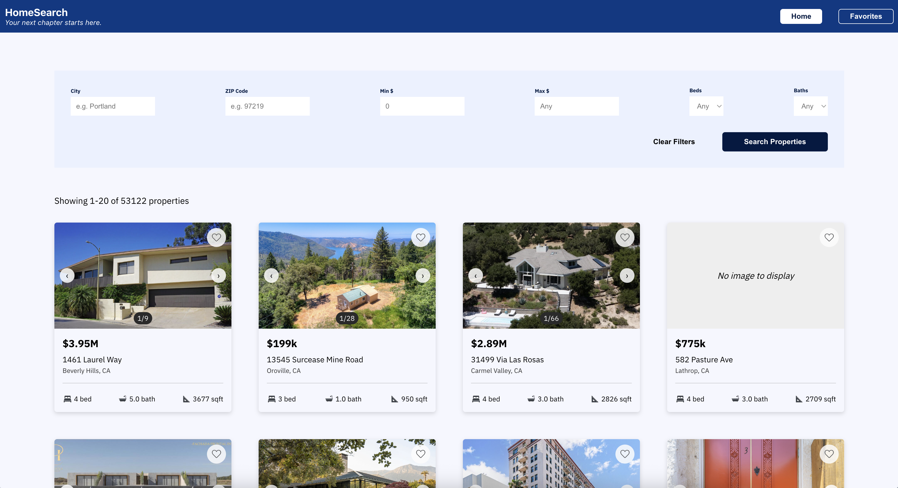

# SDE-IDX-Exchange-Intern (Summer 2026)

## HomeSearch
A full-stack real estate property search application that allows users to browse MLS property listings, filter properties, view property details and openhouses, and save favorite properties.



## Tech Stack
### Frontend
- React 19.2.7
- React Router 7.18.2
- JavaScript
- HTML / CSS
- Jest 6.9.1
- React Testing Library 16.3.2

### Backend
- Node.js 22.14.0
- Express.js 5.2.1
- Jest 30.4.2
- Supertest 7.2.2

### Database
- MySQL 8
- Docker

### Development Tools
- Git
- GitHub
- VS Code

## Project Structure  
```text
SDE-IDX-Exchange-Intern/
├── frontend/
│   ├── src/
│   ├── package.json
│   └── ...
├── backend/
│   ├── routes/
│   ├── db.js
│   ├── server.js
│   ├── ...
│   └── package.json
├── docs/
│   └── homepage.png
└── README.md
```

## Local Setup
### Prerequisites

Install the following before starting:
- Node.js
- npm
- Docker Desktop
- Git

### 1. Clone the repository
```bash
git clone <REPOSITORY_URL>
cd SDE-IDX-Exchange-Intern
```

### 2. Install dependencies
Backend:
```bash
cd backend
npm install
```

Frontend:
```bash
cd ../frontend
npm install
```

### 3. Set up MySQL
Make sure Docker Desktop is installed and running.
Create a local MySQL 8 container:
```bash
docker run --name idx-mysql-local \ 
  -e MYSQL_ROOT_PASSWORD=<password> \ 
  -e MYSQL_DATABASE=<database_name> \ 
  -p <port>:3306 \ 
  -d mysql:8
```

Replace <password> and <database_name> with your desired values.

To stop the container:
```bash
docker stop idx-mysql-local
```

To start the container again:
```bash
docker start idx-mysql-local
```

To verify that the container is running:
```bash
docker ps
```

### 4. Set up the database
The database files are not included in this repository as they are confidential data.

To import the files into the MySQL database:
```bash
docker exec -i idx-mysql-local \
  mysql -u root -p"<password>" <database_name> < <file>.sql
```

Replace <password>, <database_name>, and <file>.sql with the appropriate values.

To verify the tables were imported:

```bash
docker exec -it idx-mysql-local \
  mysql -u root -p"<password>" <database_name>
```

Then run:

```sql
SHOW TABLES;
```

### 5. Configure environment variables
Create a `.env` file in the `backend/` directory:
```env
DB_HOST=localhost
DB_PORT=<mysql_port>
DB_USER=root
DB_PASSWORD=<database_password>
DB_NAME=<database_name>
PORT=<backend_port>
```

### 6. Run the application

Make sure the MySQL container is running if it is not already running:

```bash
docker start idx-mysql-local
```

Start the backend:

```bash
cd backend
npm run dev
```

In a separate terminal, start the frontend:

```bash
cd frontend
npm start
```

### Architecture
This application follows a three tier architecture which consists of the React frontend, a Node.js/Express backend, and a MySQL database.

```text
┌──────────────────────────┐
│      React Frontend      │
│                          │
│  • Property search       │
│  • Filters & pagination  │
│  • Property details      │
│  • Favorites             │
└────────────┬─────────────┘
             │
             │ HTTP requests
             ▼
┌──────────────────────────┐
│   Node.js + Express API  │
│                          │
│  • REST API endpoints    │
│  • Request handling      │
│  • Filtering & pagination│
│  • Database queries      │
└────────────┬─────────────┘
             │
             │ SQL queries
             ▼
┌──────────────────────────┐
│        MySQL 8           │
│                          │
│  • Property listings     │
│  • Open house data       │
│  • Property information  │
└──────────────────────────┘
```

#### Frontend
The React frontend provides the user interface for the application allowing users to browse and search through the S property listings visually.

Based on the user's filter criteria, it sends HTTPS GET requests to the backend API and displays the returned property data.

#### Backend
The Node.js and Express backend provides the API for handling requests from the frontend and retrieving data from the MySQL database.

It receives property search requests, applies the filters and pagination, queries the MySQL database, and returns the requested property data to the frontend to be displayed.

### Database
MySQL 8 stores the MLS property search and open house data. 

The backend communicates with this database using SQL queries to filter and retrieve property information.

### API Reference

#### GET /api/properties
Returns a paginated list of property listings. Results can be filtered by city, zip, price, number of bedrooms, and number of bathrooms.

#### Query Parameters
| Parameter | Description | Default |
|---|---|---|
| `limit` | Number of properties to return (1–100) | `20` |
| `offset` | Number of properties to skip | `0` |
| `city` | Filter by city | — |
| `zipcode` | Filter by ZIP code | — |
| `minPrice` | Minimum property price | — |
| `maxPrice` | Maximum property price | — |
| `beds` | Minimum number of bedrooms | — |
| `baths` | Minimum number of bathrooms | — |

#### Example Request
```http
GET /api/properties?limit=20&offset=0&city=los+angeles&zipcode=90069&minPrice=800000&beds=4&baths=3
```

#### Example Response
```json
{
  "total": 50,
  "limit": 20,
  "offset": 0,
  "results": [
    {
      "L_ListingID": "1158362791",
      "L_Address": "8353 Sunset View Drive",
      "L_Zip": "90069",
      "L_City": "Los Angeles",
      "L_State": "CA",
      "L_Keyword2": 4,
      "LM_Dec_3": "3.0",
      "L_SystemPrice": 2275000
    }
  ]
}
```

> The property response contains additional fields from the database table. The example above only shows a subset of those fields.

The property details can be viewed here: http://localhost:<backend_port>/api/properties?limit=20&offset=0&<additional_filters>

#### Error Responses
Invalid query parameters return `400 Bad Request`

Example: 
```bash
GET /api/properties?limit=20&offset=0&minPrice=-800000
```
Response: 
```json
{
  "status": "error",
  "message": "minPrice must be a whole number greater than or equal to 0"
}
```

### GET /api/properties/:id
Returns information for a single property using its listing ID.

#### Example Request
```http
GET /api/properties/1118372790
```
#### Example Response
```json
{
  "L_ListingID": "1118372790",
  "L_Zip": "95391",
  "L_City": "Mountain House",
  "L_State": "CA",
  "L_Keyword2": 5,
  "LM_Dec_3": "3.0"
}
```

> The property response contains additional fields from the database table. The example above only shows a subset of those fields.

#### Error Responses
If the ID is invalid:
```json
{
  "status": "error",
  "message": "Invalid listing ID"
}
```


If the property does not exist:
```json
{
  "status": "error",
  "message": "Property not found"
}
```


### GET /api/properties/:id/openhouses
Returns the open houses associated with a specific property ordered by date and start time.

#### Example Request
```http
GET /api/properties/1174727258/openhouses
```
#### Example Response
```json
[
  {
    "L_ListingID": "1174727258",
    "OpenHouseDate": "2026-06-23T07:00:00.000Z",
    "OH_StartTime": "11:00:00",
    "OH_EndTime": "14:00:00",
    "OH_StartDate": "2026-06-23T07:00:00.000Z",
    "OH_EndDate": "2026-06-23T07:00:00.000Z"
  }
]
```

> The property response contains additional fields from the database table. The example above only shows a subset of those fields.

#### Error Responses
If the ID is invalid:
```json
{
  "status": "error",
  "message": "Invalid listing ID"
}
```


If the property does not exist:
```json
{
  "status": "error",
  "message": "Property not found"
}
```

#### Additional Response
If the property does not have an open house, the response returns an empty array: []


## Database Schema
The application uses two tables in the database `rets`: 
- `rets_property`: Stores MLS property listing information
- `rets_openhouse`: Stores openhouse information for property listings if available

### Key Columns

#### `rets_property`
- `L_ListingID`: identifies a property listing
- `L_Zip`: property zipcode
- `L_City`: property city
- `L_State`: property state
- `L_SystemPrice`: property listing price
- `L_Keyword2`: number of bedrooms in property
- `LM_Dec_3`: number of bathroom in property
- `LMD_MP_Latitude`, `LMD_MP_Longitude`: coordinates of property

#### `rets_openhouse`
- `L_ListingID`: identifies the property associated with the openhouse
- `OpenHouseDate`: openhouse date
- `OH_StartTime`: time openhouse starts
- `OH_EndTime`: time openhouse ends
- `OpenHouseRemarks`: notes about property

### Relationships
`rets_openhouse.L_ListingID` is used to associate open house records with properties in `rets_property`

## Known Issues
- MLS photo data is missing for many properties due to broken or invalid image data
- Openhouse data is unavailable for many listings due to dataset
- Some property listings are missing their coordinates which prevents the Google Map from showing

## Future Improvements
- Preserve search filters and pagination when navigating back to search results
- Improve handling of invalid or unavailable property image URLs instead of generating alt text
- Add user authentication so favorites can be saved and accessed across devices
- Add property sorting functionality (ex. sort by price)
